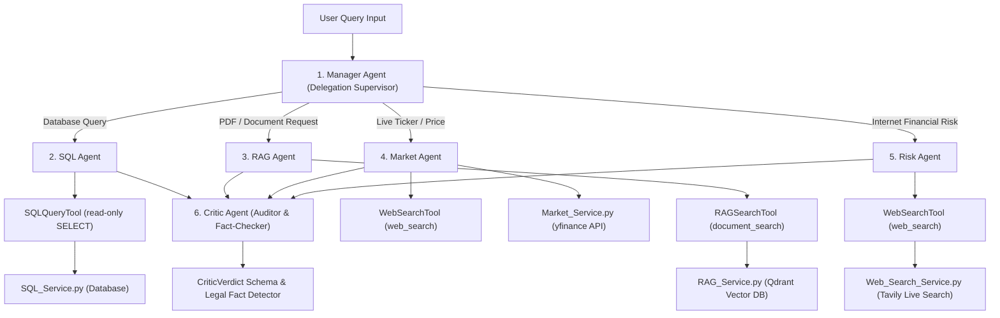

# Multi-Agent Tools & Capabilities — Architecture & Technical Guide

## Executive Summary

The **Finance Risk & Investment Intelligent System** uses a specialized **Multi-Agent Architecture** powered by **CrewAI**, **LangGraph**, and custom tool integration wrappers. Rather than using a single monolithic AI model with generic capabilities, the platform deploys **6 specialized agents**, each equipped with dedicated tools, service integrations, and domain boundaries.

This document details **Which Tools** each agent uses, **Why** those tools are assigned, **In Which Files** they are implemented, and **How** they operate.

---

## Agent & Tool Architecture Overview



---

## 1. AGENT-BY-AGENT TOOL BREAKDOWN

### 1. Manager Agent ("Finance Intelligence Manager")
- **File**: `[backend/Agents/ManagerAgent.py](file:///d:/NIIT/Project_Step/financeintel/backend/Agents/ManagerAgent.py)`
- **Tools Assigned**: Native CrewAI Agent Delegation (`allow_delegation=True`).
- **Why It Is Used**: Acts as the workflow supervisor. Evaluates user intent and routes execution to EXACTLY ONE specialist agent (SQL, RAG, Market, or Risk).
- **How It Works**: Receives runtime prompt context (`detected_symbols`, `market_data`, `documents_note`, `database_schema`), delegates execution to the single best specialist agent, and formats the output into dynamic Markdown.

---

### 2. SQL Agent ("SQL Agent")
- **File**: `[backend/Agents/SQLAgent.py](file:///d:/NIIT/Project_Step/financeintel/backend/Agents/SQLAgent.py)`
- **Tools Assigned**: `SQLQueryTool()` defined in `[sql_tool.py](file:///d:/NIIT/Project_Step/financeintel/backend/Agents/tools/sql_tool.py)`.
- **Why It Is Used**: Queries internal uploaded financial databases (`portfolio_holdings`, `asset_risk_logs`, `investment_decisions`, `market_indicators`, `portfolios`).
- **How It Works**: Generates parameterized `SELECT` queries against the retrieved database schema, executes them via `run_readonly_query()`, and converts SQL result sets into clean Markdown tables.
- **Safety Enforcement**: Strictly blocks DDL/DML write statements (`DROP`, `DELETE`, `UPDATE`, `INSERT`).

```python
# Tool assignment in backend/Agents/SQLAgent.py
sql_agent = Agent(
    role="SQL Agent",
    goal="Answer questions about data stored in the uploaded SQL database...",
    tools=[SQLQueryTool()],
    llm=agent_llm,
)
```

---

### 3. RAG Agent ("Document RAG Specialist")
- **File**: `[backend/Agents/RAGAgent.py](file:///d:/NIIT/Project_Step/financeintel/backend/Agents/RAGAgent.py)`
- **Tools Assigned**: `RAGSearchTool()` defined in `[rag_tool.py](file:///d:/NIIT/Project_Step/financeintel/backend/Agents/tools/rag_tool.py)`.
- **Why It Is Used**: Retrieves grounding evidence from uploaded PDF, DocX, and TXT policy documents (e.g. Basel III summaries, risk management policies).
- **How It Works**: Converts natural language queries into 1536-dimensional dense vector embeddings, executes Cosine similarity search against Qdrant vector memory, and formats top-$k$ passages with source citations (`[SOURCE: filename | relevance=0.92]`).

```python
# Tool assignment in backend/Agents/RAGAgent.py
rag_agent = Agent(
    role="Document RAG Specialist",
    goal="Search uploaded PDF documents to answer user queries accurately...",
    tools=[RAGSearchTool()],
    llm=agent_llm,
)
```

---

### 4. Market Agent ("Market Data Analyst")
- **File**: `[backend/Agents/MarketAgent.py](file:///d:/NIIT/Project_Step/financeintel/backend/Agents/MarketAgent.py)`
- **Tools & Services Assigned**:
  1. `WebSearchTool()` defined in `[web_search_tool.py](file:///d:/NIIT/Project_Step/financeintel/backend/Agents/tools/web_search_tool.py)`.
  2. `MarketService` integrated via `[Market_Service.py](file:///d:/NIIT/Project_Step/financeintel/backend/Services/Market_Service.py)` (`yfinance` API).
  3. `ticker_extractor` defined in `[ticker_extractor.py](file:///d:/NIIT/Project_Step/financeintel/backend/Utils/ticker_extractor.py)`.
- **Why It Is Used**: Fetches real-time stock prices, historical 1-year price performance, annualized volatility percentages, and live market news.
- **How It Works**: Automatically parses stock tickers (AAPL, NVDA, TSLA) from user prompts, fetches live price and volatility metrics via `yfinance`, and searches live market news via Tavily Web Search.

```python
# Tool assignment in backend/Agents/MarketAgent.py
market_agent = Agent(
    role="Market Data Analyst",
    goal="Analyze market trends, compare asset performance, and fetch live financial quotes...",
    tools=[WebSearchTool()],
    llm=agent_llm,
)
```

---

### 5. Risk Agent ("Risk Intelligence Specialist")
- **File**: `[backend/Agents/RiskAgent.py](file:///d:/NIIT/Project_Step/financeintel/backend/Agents/RiskAgent.py)`
- **Tools Assigned**: `WebSearchTool()` defined in `[web_search_tool.py](file:///d:/NIIT/Project_Step/financeintel/backend/Agents/tools/web_search_tool.py)`.
- **Why It Is Used**: Analyzes external global market risks, macroeconomic indicators (inflation, central bank rate decisions), sector volatility, regulatory changes, and credit default trends.
- **How It Works**: Uses `WebSearchTool()` to gather up-to-date financial risk intelligence from internet publications and market news, evaluating external financial threats independently of internal portfolio database tables.

```python
# Tool assignment in backend/Agents/RiskAgent.py
risk_agent = Agent(
    role="Risk Intelligence Specialist",
    goal="Search the internet and web sources to identify and analyze market-wide financial risks...",
    tools=[WebSearchTool()],
    llm=agent_llm,
)
```

---

### 6. Critic Agent ("Senior Financial Analyst & Fact-Checker")
- **File**: `[backend/Agents/CriticAgent.py](file:///d:/NIIT/Project_Step/financeintel/backend/Agents/CriticAgent.py)` & `[Critic.py](file:///d:/NIIT/Project_Step/financeintel/backend/Nodes/Critic.py)`
- **Tools & Analysis Methods**:
  1. Legal Fact Gap Detector (`detect_incomplete_legal_question()`).
  2. Pydantic Structured Output Decoder (`with_structured_output(CriticVerdict)`).
- **Why It Is Used**: Acts as the system auditor. Evaluates generated draft answers for source attribution, factual grounding, mathematical consistency, and missing legal facts.
- **How It Works**: Assigns a `confidence` score (0.00 to 1.00), flags specific discrepancies, and generates actionable `revision_instructions` if confidence is below `0.70`.

---

## 2. DETAILED TOOL IMPLEMENTATION BREAKDOWN

### 1. `SQLQueryTool` (`sql_query`)
- **File**: `[backend/Agents/tools/sql_tool.py](file:///d:/NIIT/Project_Step/financeintel/backend/Agents/tools/sql_tool.py)`
- **Input Schema**: `SQLQueryInput` (`query: str`).
- **Underlying Engine**: `run_readonly_query()` in `[SQL_Service.py](file:///d:/NIIT/Project_Step/financeintel/backend/Services/SQL_Service.py)`.
- **Why & How**: Accepts a single read-only `SELECT` string generated by `SQLAgent`, executes it against PostgreSQL/SQLite, and returns a formatted Markdown table string.

```python
class SQLQueryTool(BaseTool):
    name: str = "sql_query"
    description: str = "Executes a read-only SQL SELECT query against the currently uploaded database..."
    args_schema: type[BaseModel] = SQLQueryInput

    def _run(self, query: str) -> str:
        return run_readonly_query(query)
```

---

### 2. `RAGSearchTool` (`document_search`)
- **File**: `[backend/Agents/tools/rag_tool.py](file:///d:/NIIT/Project_Step/financeintel/backend/Agents/tools/rag_tool.py)`
- **Input Schema**: `RAGSearchInput` (`query: str`, `top_k: int = 3`).
- **Underlying Engine**: `rag_service.search()` in `[RAG_Service.py](file:///d:/NIIT/Project_Step/financeintel/backend/Services/RAG_Service.py)`.
- **Why & How**: Queries Qdrant vector memory for uploaded PDF/DocX/TXT documents and returns top-$k$ relevant text chunks formatted with source citations.

```python
class RAGSearchTool(BaseTool):
    name: str = "document_search"
    description: str = "Searches documents the user has uploaded (PDF, DOCX, or TXT)..."
    args_schema: type[BaseModel] = RAGSearchInput

    def _run(self, query: str, top_k: int = 3) -> str:
        results = rag_service.search(query, k=top_k)
        ...
        return "\n---\n".join(formatted)
```

---

### 3. `WebSearchTool` (`web_search`)
- **File**: `[backend/Agents/tools/web_search_tool.py](file:///d:/NIIT/Project_Step/financeintel/backend/Agents/tools/web_search_tool.py)`
- **Input Schema**: `WebSearchInput` (`query: str`).
- **Underlying Engine**: `web_search()` in `[Web_Search_Service.py](file:///d:/NIIT/Project_Step/financeintel/backend/Services/Web_Search_Service.py)` (Tavily Search API).
- **Why & How**: Executes live internet searches over financial publications for real-world market news, interest rate policies, and industry risk trends, returning titles, snippets, and source URLs.

```python
class WebSearchTool(BaseTool):
    name: str = "web_search"
    description: str = "Searches the live web for current, real-world financial/market information..."
    args_schema: type[BaseModel] = WebSearchInput

    def _run(self, query: str) -> str:
        results = web_search(query)
        ...
        return "\n---\n".join(formatted)
```

---

### 4. `MarketService` (Live Market & Ticker Service)
- **File**: `[backend/Services/Market_Service.py](file:///d:/NIIT/Project_Step/financeintel/backend/Services/Market_Service.py)`
- **Underlying API**: `yfinance` Python SDK.
- **Why & How**: Fetches fast price info (`yf.Ticker(symbol).fast_info["lastPrice"]`), 1-year historical price data, and computes annualized volatility percentages ($\text{std} \times \sqrt{252}$).

---

## Master Agent & Tools Comparison Matrix

| Agent Name | Role | Primary Tool(s) | Tool Implementation File | Primary Data Source |
| :--- | :--- | :--- | :--- | :--- |
| **Manager Agent** | Supervisor Orchestrator | Delegation Tool (`allow_delegation=True`) | [ManagerAgent.py](file:///d:/NIIT/Project_Step/financeintel/backend/Agents/ManagerAgent.py) | Specialist Outputs & Prompt Context |
| **SQL Agent** | Database Analyst | `SQLQueryTool` (`sql_query`) | [sql_tool.py](file:///d:/NIIT/Project_Step/financeintel/backend/Agents/tools/sql_tool.py) | Uploaded PostgreSQL / SQLite Database |
| **RAG Agent** | Document Specialist | `RAGSearchTool` (`document_search`) | [rag_tool.py](file:///d:/NIIT/Project_Step/financeintel/backend/Agents/tools/rag_tool.py) | Qdrant Vector DB (Uploaded PDFs/DocX) |
| **Market Agent** | Market Data Analyst | `WebSearchTool` + `MarketService` | [web_search_tool.py](file:///d:/NIIT/Project_Step/financeintel/backend/Agents/tools/web_search_tool.py) & [Market_Service.py](file:///d:/NIIT/Project_Step/financeintel/backend/Services/Market_Service.py) | `yfinance` API & Tavily Live Web Search |
| **Risk Agent** | Risk Specialist | `WebSearchTool` (`web_search`) | [web_search_tool.py](file:///d:/NIIT/Project_Step/financeintel/backend/Agents/tools/web_search_tool.py) | Tavily Live Web Search (External Risks) |
| **Critic Agent** | Auditor & Fact Checker | `CriticVerdict` + `detect_incomplete_legal_question` | [CriticAgent.py](file:///d:/NIIT/Project_Step/financeintel/backend/Agents/CriticAgent.py) | Pydantic Schema & Fact Gap Evaluator |

---

## Summary Checklist

- [x] **Which Tools**: `SQLQueryTool`, `RAGSearchTool`, `WebSearchTool`, `MarketService` (`yfinance`), `CriticVerdict` Pydantic Schema, `detect_incomplete_legal_question()`.
- [x] **Which Agents**: Manager Agent, SQL Agent, RAG Agent, Market Agent, Risk Agent, Critic Agent.
- [x] **Which Files**: `ManagerAgent.py`, `SQLAgent.py`, `RAGAgent.py`, `MarketAgent.py`, `RiskAgent.py`, `CriticAgent.py`, `sql_tool.py`, `rag_tool.py`, `web_search_tool.py`, `Market_Service.py`, `Web_Search_Service.py`.
- [x] **Why & How**: Complete deep-dive explanations, code snippets, input schemas, safety checks, and data sources for every tool and agent.
