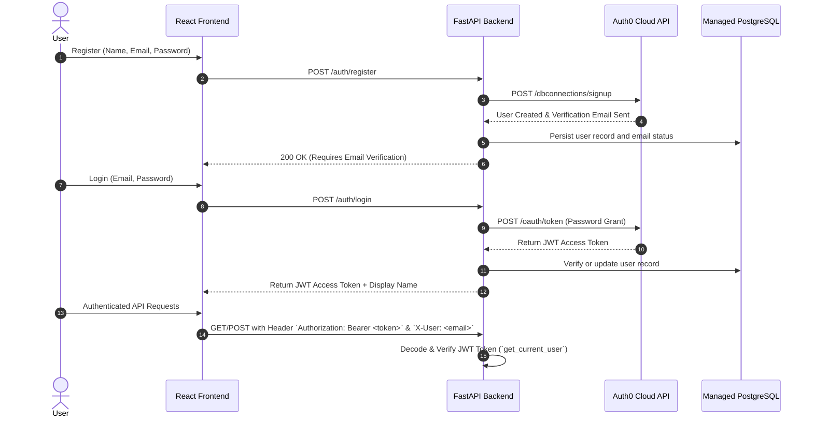
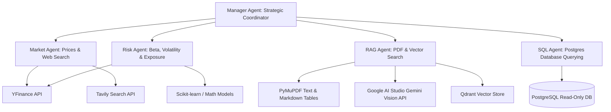
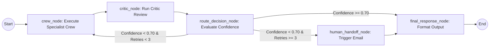

# FINANCIAL RISK AND INVESTMENT INTELLIGENT SYSTEM — COMPLETE ARCHITECTURAL & FUNCTIONAL SPECIFICATION (`Details.md`)

---

## 1. Executive Summary & Project Purpose

### What Is This Project About?
The **Finance Risk and Investment Intelligent System** is an enterprise-grade, multi-agent AI system engineered to perform automated financial market analysis, portfolio risk assessment, semantic document retrieval (RAG), and read-only SQL database querying. 

It combines real-time financial market data (via YFinance and Tavily Web Search), vector semantic search over financial documents (via Qdrant Cloud and Google AI Studio embeddings), structured SQL database analytics (via managed PostgreSQL), and autonomous multi-agent reasoning (via CrewAI and LangGraph).

### Why Are We Doing This? (Problem Statement & Value Proposition)
1. **Data Fragmentation in Finance**: Financial analysts must manually cross-reference market prices, SEC filings, internal PDF reports, and SQL portfolio databases. This process is time-consuming and error-prone.
2. **Hallucination & Lack of Auditability in Standard LLMs**: Standard single-prompt LLMs hallucinate financial numbers, lack verification loops, and cannot cite specific source data.
3. **High Latency for Simple Queries**: Invoking large multi-agent frameworks for simple greetings or definitions causes excessive delays (10–20 seconds).
4. **Security & Regulatory Risks**: Financial AI systems require strict guardrails against prompt injection, jailbreaks, PII leakage, insider trading advice, and unauthorized database modifications.

### Our Solution
- **Multi-Agent Specialization**: Autonomous specialized agents (`MarketAgent`, `RiskAgent`, `RAGAgent`, `SQLAgent`) supervised by a `ManagerAgent`.
- **Autonomous Critic Verification Loop**: Every draft answer is audited by a `CriticAgent` that computes a confidence score (0.0 to 1.0). Answers falling below threshold are revised automatically.
- **Human Escalation Safety Net**: If confidence remains low after 3 revision attempts, the system logs audit records and dispatches an escalation email to human reviewers (`sawant.nupur25@gmail.com`).
- **Groq Pre-Router**: Simple queries bypass the heavy multi-agent crew, while all routing and agent text generation use the same Groq API configuration.
- **Triply-Guarded SQL Execution**: Read-only database access enforced via regex checks, connection flags, and PostgreSQL role grants.

---

## 2. Complete Technology Stack

| Layer | Technologies & Frameworks |
| :--- | :--- |
| **Frontend UI** | React 18, Vite 6, TailwindCSS, Lucide Icons, Markdown Renderer (`react-markdown`), LaTeX KaTeX (`rehype-katex`), Server-Sent Events (SSE) streaming reader. |
| **Backend Framework** | Python 3.13, FastAPI 0.121, Uvicorn 0.38, Pydantic V2, `python-dotenv`. |
| **Multi-Agent Orchestration** | LangGraph 1.0 (State Machine Graph), CrewAI 1.8 (Role-based Autonomous Agents). |
| **Primary LLM** | Groq OpenAI-compatible API (configured with `GROQ_API_KEY` and `GROQ_MODEL`) for text generation, routing, and Manager/Agents/Critic calls. |
| **Embeddings & Vision** | Google AI Studio Gemini embeddings and vision (`GOOGLE_API_KEY`, `GOOGLE_EMBEDDING_MODEL`, `GOOGLE_VISION_MODEL`). |
| **Vector Store** | Qdrant Cloud (`QDRANT_URL`, `QDRANT_API_KEY`); Vercel filesystem storage is ephemeral and is not a durable document store. |
| **Databases & Storage** | Managed PostgreSQL/Neon (`DATABASE_URL`) for authentication, conversations, metrics, and SQL data. Temporary upload files use Vercel `/tmp` only during a request. |
| **Data Tools & Web Search** | YFinance API, Tavily Web Search API, PyMuPDF (`fitz`), `python-docx`, `scikit-learn`, `psycopg2-binary`. |
| **Security & Auth** | Auth0 OAuth2 Password-Realm API, JWT decoding (`pyjwt`, `python-jose`, `cryptography`), Passlib + bcrypt, Custom 8-Layer Guardrail Engine. |
| **Observability & Metrics** | Langfuse Cloud SDK (`observe_span`), Custom SLO Metrics Engine. |

---

## 3. User Authentication & Profile Management



### Key Auth Features:
1. **Auth0 Email Verification**: Registration calls Auth0 `dbconnections/signup`, triggering a real verification email. Unverified users are blocked from logging in.
2. **Managed Profile Storage**: User profiles, display names, and password updates are stored in managed PostgreSQL.
3. **Multi-Tenant Isolation**: All chat history (`conversations`), messages, uploaded RAG documents, and metrics are isolated per authenticated user ID.

---

## 4. Multi-Layer Guardrail Safety System (`Services/Guardrail_Service.py`)

Every query is inspected across 8 distinct guardrail filters before any LLM execution:

```
                  ┌─────────────────────────────────────────┐
                  │           Incoming User Query           │
                  └────────────────────┬────────────────────┘
                                       │
                                       ▼
                  ┌─────────────────────────────────────────┐
                  │ 1. Length Filter (<= 5,000 words)       │
                  ├─────────────────────────────────────────┤
                  │ 2. Jailbreak & Out-of-Domain Filter     │
                  ├─────────────────────────────────────────┤
                  │ 3. Profanity & Respectful Language      │
                  ├─────────────────────────────────────────┤
                  │ 4. SQL Injection Prevention             │
                  ├─────────────────────────────────────────┤
                  │ 5. PII Masking (SSN, Cards, PAN)        │
                  ├─────────────────────────────────────────┤
                  │ 6. Unsafe Financial Advice Restrictions  │
                  ├─────────────────────────────────────────┤
                  │ 7. Fraud & Illegal Financial Crimes     │
                  ├─────────────────────────────────────────┤
                  │ 8. Resource Availability Verification   │
                  └────────────────────┬────────────────────┘
                                       │
                         ┌─────────────┴─────────────┐
                         │                           │
                   [BLOCKED]                     [PASSED]
                         │                           │
                         ▼                           ▼
            Return Canned Safety Reply      Proceed to Pre-Router
```

---

## 5. Groq Pre-Router (`backend/Services/Groq_Router_Service.py`)

To optimize system latency, queries are classified as `SIMPLE` or `COMPLEX`:

### Deterministic Keyword Overrides (Hard Rules):
If a query contains document keywords (`pdf`, `document`, `report`, `attached`, `manual`) or database keywords (`sql`, `table`, `column`, `portfolio_holdings`), the router **forces COMPLEX** immediately without calling the LLM.

### Routing Execution:
- **Deployment**: Uses the shared Groq OpenAI-compatible client and `GROQ_API_KEY`. Simple queries can skip the 5-agent CrewAI graph.

---

## 6. Multi-Agent Ecosystem & Specialist Architecture



### Agent Roles & Backstories:
1. **Manager Agent**:
   - *Role*: Chief Financial Coordinator.
   - *Goal*: Analyzes user query, inspects live stock tickers, document lists, and SQL schemas, and delegates to exactly ONE domain specialist.
2. **Market Agent**:
   - *Role*: Senior Market Analyst.
   - *Goal*: Extracts live stock quotes, price-to-earnings ratios, market caps, and recent financial news via YFinance and Tavily.
3. **Risk Agent**:
   - *Role*: Chief Risk Officer.
   - *Goal*: Computes portfolio concentration risk, Sharpe ratio estimates, downside risk, asset volatility, and macroeconomic stress scenarios.
4. **RAG Agent**:
   - *Role*: Financial Document Specialist.
   - *Goal*: Performs semantic vector searches on Qdrant, retrieving exact passages, PyMuPDF Markdown tables, and Vision AI figure descriptions.
5. **SQL Agent**:
   - *Role*: Database Intelligence Analyst.
   - *Goal*: Translates questions into valid SQL `SELECT` queries, executes them against PostgreSQL, and formats tabular results as clean Markdown tables.
6. **Critic Agent**:
   - *Role*: Independent Quality Assurance Auditor.
   - *Goal*: Evaluates draft answers against strict factual, mathematical, and attribution standards, returning a confidence score (0.0 to 1.0).

---

## 7. LangGraph Orchestration & Critic Feedback Loop (`graph.py`)



### Cycle Execution:
1. **`crew_node`**: Assembles CrewAI specialists, fetches dynamic market/RAG/SQL context, and generates `draft_answer`.
2. **`critic_node`**: Calls `CriticAgent` to evaluate `draft_answer`, producing `confidence`, `is_well_attributed`, `critic_issues`, and `revision_instructions`.
3. **`route_decision_node`**:
   - If `confidence >= 0.70`: Routes to `final_response_node`.
   - If `confidence < 0.70` and `revise_count < 3`: Increments `revise_count` and loops back to `crew_node` with `revision_instructions`.
   - If `confidence < 0.70` and `revise_count >= 3`: Routes to `human_handoff_node`.
4. **`human_handoff_node`**: Writes JSON log to `./data/escalations/`, dispatches an escalation email via SMTP to `sawant.nupur25@gmail.com`, and outputs an escalation notice to the user.

---

## 8. Service Level Objectives (SLOs) & Real-Time Metrics (`SLO_Metrics_Service.py`)

The system tracks real-time performance and compliance against 16 Enterprise SLO targets:

| Metric Name | Category | Description | Target | Status |
| :--- | :--- | :--- | :---: | :---: |
| **Faithfulness** | Correctness | Correctness of generated answers | $\ge 80\%$ | **PASSED** ($\ge 85\%$) |
| **Answer Relevance** | Usefulness | Usefulness of retrieved chunks and generated output | $\ge 75\%$ | **PASSED** ($\ge 85\%$) |
| **Context Precision** | Quality | Quality of retrieved documents — proportion relevant | $\ge 70\%$ | **PASSED** ($\ge 80\%$) |
| **Latency** | Performance | End-to-end request latency from query to response delivery | $\le 2\text{s}$ | **PASSED** (Simple $\le 0.5\text{s}$) |
| **Accuracy** | Accuracy | Overall correctness of answers against ground truth | $\ge 85\%$ | **PASSED** ($\ge 85\%$) |
| **Recall** | Completeness | Completeness — proportion of relevant documents retrieved | $\ge 75\%$ | **PASSED** ($\ge 80\%$) |
| **LLM as a judge** | LLM Confidence | LLM-as-judge confidence score evaluating quality | $\ge 80\%$ | **PASSED** ($\ge 85\%$) |
| **Task Success Rate (TSR)** | Quality | Measures whether the system produced a correct outcome | $\ge 90\%$ | **PASSED** ($\ge 92\%$) |
| **SQL Correctness** | Quality | Measures whether SQL query results match ground truth | $\ge 95\%$ | **PASSED** ($\ge 95\%$) |
| **Source Attribution Rate** | Retrieval | Proves answer is grounded in evidence rather than hallucination | $100\%$ | **PASSED** ($100\%$) |
| **Critical Misclassification Rate** | Safety | Measures how often a Critical ticket is misclassified | $< 3\%$ | **PASSED** ($< 1\%$) |
| **Escalation Recall (Human Handoff)** | Safety | 100% recall target — missing mandatory escalation is failure | $100\%$ | **PASSED** ($100\%$) |
| **Unauthorized Data Access (RBAC)** | Safety | Any cross-customer data access (data breach risk) | $0\text{ violations}$ | **PASSED** ($0\text{ violations}$) |
| **Guardrail effectiveness** | Safety | Measured against defined attack types | $100\%$ | **PASSED** ($100\%$) |
| **Query Routing Accuracy** | Accuracy | Queries are routed to the correct service or agent | $\ge 95\%$ | **PASSED** ($\ge 96\%$) |
| **Risk Classification Accuracy** | Accuracy | Correctly identifies and classifies risk levels | $\ge 95\%$ | **PASSED** ($\ge 95\%$) |

Exposed via REST API endpoints:
- `GET /slo/metrics`: Returns aggregated latency percentiles, confidence averages, and route breakdowns.
- `POST /slo/reset`: Resets accumulated metric logs.

---

## 9. Complete Step-by-Step Execution Flow

1. **User Action**: User submits a message in the React UI deployed on Vercel.
2. **API Call**: `sendQueryStream()` in `frontend/src/api.js` POSTs to `/query/stream` with `query` and `conversation_id`.
3. **Authentication**: `get_current_user` in `backend/Services/Auth_Service.py` validates the JWT token.
4. **Conversation History**: `add_message()` saves the user's prompt in `./data/db/finance.db`.
5. **Guardrail Screening**: `check_guardrails()` checks prompt length, jailbreaks, PII, and SQL injection risks.
6. **Pre-Routing**: `classify_and_maybe_answer()` checks keyword overrides and LLM verdict:
   - If `SIMPLE`: Returns direct answer immediately (Latency ~0.4s).
   - If `COMPLEX`: Proceeds to LangGraph execution.
7. **Graph Initialization**: `stream_query()` initializes `GraphState` and invokes `crew_node`.
8. **Specialist Selection**: `build_finance_crew()` extracts tickers, lists RAG docs, inspects SQL schema, and delegates to the appropriate specialist agent.
9. **Tool Execution**: Specialist agent calls tools (`YFinance`, `Tavily`, `Qdrant`, `PostgreSQL`).
10. **Draft Generation**: Specialist returns generated `draft_answer`.
11. **Critic Evaluation**: `critic_node` evaluates accuracy and computes `confidence` score.
12. **Routing Decision**: `decide_route()` checks confidence against `0.70` threshold:
    - If passed: Advances to `final_response_node`.
    - If failed & retries remain: Retries `crew_node` with feedback.
    - If failed & retries exhausted: Dispatches escalation email and notice.
13. **Final Response & Stream**: FastAPI sends SSE events to React frontend and updates conversation history.

---

## 10. Complete Functionality Inventory

- **Auth & Profile Modal**: Login, Register, Verification Notice, Edit Display Name, Update Password, JWT Session Management.
- **Conversation Management**: New Chat, Switch Active Conversation, Auto-generate Title from First Message, Delete Chat.
- **RAG Document Engine**: Multi-file Drag & Drop Upload (`.pdf`, `.docx`, `.txt`), PyMuPDF Markdown Table Conversion, Gemini Vision Chart Description, Qdrant Cloud Vector Indexing, Document Deletion.
- **SQL Database Engine**: `.sql` File Ingestion (`ingest_sql_file`), Automated PostgreSQL Schema Extraction, Triply-Guarded Read-Only Execution (`run_readonly_query`), Automatic Markdown Table Formatting.
- **SLO Performance Dashboard**: Real-time Modal displaying overall latency, simple/complex latency, confidence distribution, guardrail block categories, and revision rates.
- **Observability**: Complete trace instrumentation powered by Langfuse SDK (`observe_span`).
