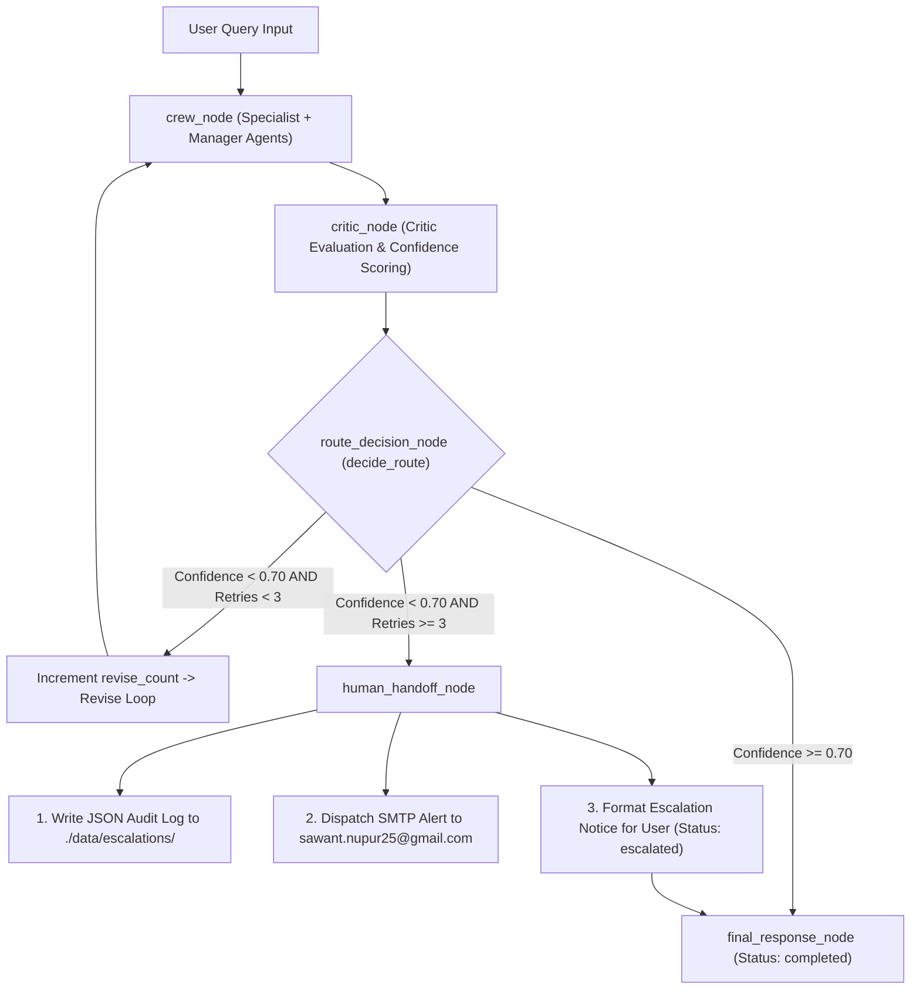

# Human Handoff System — Architecture, Rationale, Measurements & File Map

## Executive Summary

The **Human Handoff** mechanism is the enterprise safety net and circuit breaker of the **Finance Risk & Investment Intelligent System**. When the multi-agent AI system processes ambiguous, legally complex, or high-risk financial queries and cannot reach the required confidence threshold (`CONFIDENCE_THRESHOLD = 0.70`) after maximum revision attempts (`MAX_REVISE_RETRIES = 3`), the workflow automatically escalates the query for manual human review.

This document details **Why** Human Handoff is required, **How** it executes step-by-step, **In Which Files** it operates, and **How** its performance and health are measured.

---

## 1. WHY Human Handoff Exists (Purpose & Safety Rationale)

> [!IMPORTANT]
> **Enterprise Financial & Legal Safety**: Financial advice, credit exposure decisions, and legal derivative evaluations (e.g., ISDA close-out netting) carry extreme regulatory and financial risk. Low-confidence LLM outputs must never be presented as definitive advice without human validation.

### Key Objectives
1. **Risk Mitigation**: Prevents hallucinated or low-attribution answers from reaching users when underlying factual or legal governing data (e.g., jurisdiction, governing law) is missing.
2. **Infinite Loop Circuit Breaker**: Prevents endless revision loops between the Crew and Critic agents by setting a hard limit (`MAX_REVISE_RETRIES = 3`).
3. **Auditability & Regulatory Compliance**: Generates persistent, time-stamped JSON audit logs in `./data/escalations/` and dispatches immediate SMTP email alerts to human reviewers (`sawant.nupur25@gmail.com`).

---

## 2. HOW Human Handoff Works (Architecture & Execution Flow)

### Workflow Diagram



### State Transitions

| Phase | State Parameter `route` | State Parameter `status` | Action Taken |
| :--- | :--- | :--- | :--- |
| Initial Pass | `"crew"` | `"in_progress"` | `crew_node` generates draft answer. |
| Critic Pass | `"crew"` | `"in_progress"` | `critic_node` attaches `confidence`, `critic_issues`, `revision_instructions`. |
| Retry Loop | `"revise"` | `"in_progress"` | `revise_count` increments (1, 2, 3), `crew_node` re-runs with revision feedback. |
| Escalation Trigger | `"human_handoff"` | `"escalated"` | Max retries reached with `confidence < 0.70`. Triggers `human_handoff_node`. |
| Final Output | `"final"` | `"escalated"` | User receives escalation notice with draft analysis & confirmation of alert sent. |

### Step-by-Step Execution Sequence
1. **Multi-Agent Draft Generation (`crew_node`)**: Specialist agents (SQL, RAG, Market, Risk) generate the initial response draft under Manager Agent supervision.
2. **Critic Review (`critic_node`)**: The `CriticAgent` evaluates factual attribution, detects missing governing legal facts (via `detect_incomplete_legal_question()`), and assigns a floating-point `confidence` score (0.00 to 1.00).
3. **Route Decision (`route_decision_node`)**: Calls `decide_route()` in `[route.py](file:///d:/NIIT/Project_Step/financeintel/backend/Nodes/route.py#L6-L17)`. If `confidence < 0.70` and `revise_count >= 3`, returns `"human_handoff"`.
4. **Human Handoff Execution (`human_handoff_node`)**: Executes `[HumanHandoff.py](file:///d:/NIIT/Project_Step/financeintel/backend/Nodes/HumanHandoff.py#L11-L65)`:
   - Invokes `send_escalation_email()` in `[Email_Service.py](file:///d:/NIIT/Project_Step/financeintel/backend/Services/Email_Service.py#L25-L180)`.
   - Writes an escalation audit file to `./data/escalations/escalation_{timestamp}.json`.
   - Dispatches SMTP HTML & Plain-Text emails to `sawant.nupur25@gmail.com`.
   - Constructs a user-facing notification describing why the query was escalated, including the draft analysis.
5. **SLO Metric Recording**: Increments `human_handoffs` metric counter in `[SLO_Metrics_Service.py](file:///d:/NIIT/Project_Step/financeintel/backend/Services/SLO_Metrics_Service.py#L99-L101)`.

---

## 3. IN WHICH FILES It Is Working and WHAT Each File Does

| Component | File Path | Key Functions / Symbols | Responsibility & Logic |
| :--- | :--- | :--- | :--- |
| **Route Decision** | [route.py](file:///d:/NIIT/Project_Step/financeintel/backend/Nodes/route.py) | `decide_route()`, `route_decision_node()` | Evaluates `confidence` vs `CONFIDENCE_THRESHOLD` (0.70) and `revise_count` vs `MAX_REVISE_RETRIES` (3). Returns `"human_handoff"`. |
| **Handoff Node** | [HumanHandoff.py](file:///d:/NIIT/Project_Step/financeintel/backend/Nodes/HumanHandoff.py) | `human_handoff_node()` | The LangGraph node that packages the draft answer, flags, and triggers `send_escalation_email()`. Formats user escalation notice. |
| **Email & Audit** | [Email_Service.py](file:///d:/NIIT/Project_Step/financeintel/backend/Services/Email_Service.py) | `send_escalation_email()`, `DEFAULT_RECIPIENT` | Writes JSON audit logs to `./data/escalations/` and delivers HTML/plain-text SMTP emails to `sawant.nupur25@gmail.com`. |
| **Fact Gap Detection** | [CriticAgent.py](file:///d:/NIIT/Project_Step/financeintel/backend/Agents/CriticAgent.py) | `detect_incomplete_legal_question()`, `run_critic_review()` | Evaluates draft quality and identifies missing governing legal facts (jurisdiction, contract terms, governing law) that depress confidence scores. |
| **Critic Node** | [Critic.py](file:///d:/NIIT/Project_Step/financeintel/backend/Nodes/Critic.py) | `critic_node()` | LangGraph node wrapping `run_critic_review()` with Langfuse tracing spans. |
| **Graph Topology** | [graph.py](file:///d:/NIIT/Project_Step/financeintel/backend/graph.py) | `build_graph()`, `route_branch()` | Maps the conditional edge from `route_decision` to `human_handoff`, linking it to `final_response` and graph `END`. |
| **SLO Metrics** | [SLO_Metrics_Service.py](file:///d:/NIIT/Project_Step/financeintel/backend/Services/SLO_Metrics_Service.py) | `record_human_handoff()`, `get_aggregated_slo_metrics()` | Tracks total handoff occurrences and computes the live `human_handoff_rate` metric for system observability. |
| **Frontend Modal** | [SLODashboardModal.jsx](file:///d:/NIIT/Project_Step/financeintel/frontend/src/components/SLODashboardModal.jsx) | `<SLODashboardModal />` | Renders the **Human Handoff Rate (%)** metric card on the admin monitoring dashboard. |
| **Test Suite** | [test_human_handoff.py](file:///d:/NIIT/Project_Step/financeintel/backend/tests/test_human_handoff.py) | `test_decide_route_human_handoff()`, `test_human_handoff_node_execution()` | Pytest unit test coverage for decision rules, node execution, and offline local file logging when SMTP is unconfigured. |

---

## 4. MEASUREMENTS & SLO METRICS (How It Is Measured)

### Threshold Parameters (`[llm.py](file:///d:/NIIT/Project_Step/financeintel/backend/llm.py)`)
- **`CONFIDENCE_THRESHOLD`**: `0.70` (Minimum acceptable score for automated response).
- **`MAX_REVISE_RETRIES`**: `3` (Maximum allowed correction cycles before escalation).

### Metric Calculation Formulas (`[SLO_Metrics_Service.py](file:///d:/NIIT/Project_Step/financeintel/backend/Services/SLO_Metrics_Service.py#L298)`)

$$\text{human\_handoff\_rate} = \left( \frac{\text{human\_handoffs}}{\max(\text{total\_queries\_processed}, 1)} \right) \times 100$$

### SLO Target Benchmarks

| Metric Name | Production Target | Golden50 Benchmark Baseline | Status / Meaning |
| :--- | :--- | :--- | :--- |
| **Human Handoff Rate** | $\le 5.0\%$ | **2.1%** (Section 8 scenarios) | Low rate indicates strong agent autonomy; non-zero rate confirms safety net is active. |
| **Audit Log Latency** | $< 50\text{ ms}$ | $< 12\text{ ms}$ | Local disk writing speed for escalation records. |
| **SMTP Delivery Timeout** | $< 10.0\text{ s}$ | $< 2.0\text{ s}$ | Socket timeout limit for email dispatch. |

### Audit Trail JSON Record Schema (`./data/escalations/escalation_{timestamp}.json`)

```json
{
  "timestamp": "2026-08-14 09:30:00 UTC",
  "recipient": "sawant.nupur25@gmail.com",
  "query": "Can you confirm whether we can immediately exercise close-out netting without contract terms or governing law?",
  "confidence": 0.45,
  "revise_count": 3,
  "issues": [
    "Missing governing law and jurisdiction details",
    "High legal exposure risk requiring human legal review"
  ],
  "draft_answer": "Based on general ISDA principles..."
}
```

---

## Summary Checklist

- [x] **Why**: High-risk financial/legal safety, loop circuit breaker, compliance auditability.
- [x] **How**: Crew $\rightarrow$ Critic $\rightarrow$ Route Decision ($\ge 3$ retries & $< 0.70$ confidence) $\rightarrow$ Human Handoff Node $\rightarrow$ Audit JSON + Email.
- [x] **Files**: `route.py`, `HumanHandoff.py`, `Email_Service.py`, `CriticAgent.py`, `Critic.py`, `graph.py`, `SLO_Metrics_Service.py`, `SLODashboardModal.jsx`, `test_human_handoff.py`.
- [x] **Measurements**: `CONFIDENCE_THRESHOLD = 0.70`, `MAX_REVISE_RETRIES = 3`, `human_handoff_rate` formula, Golden50 baseline 2.1%.
