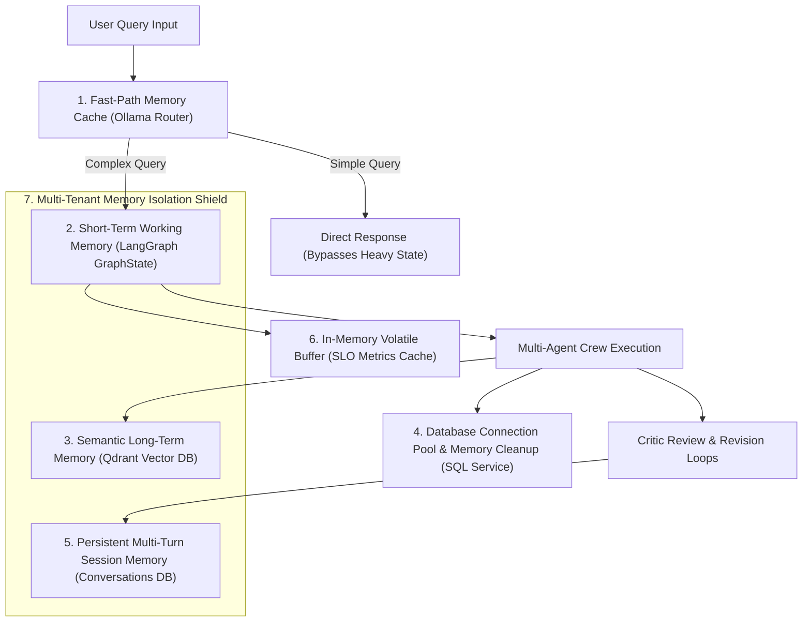

# Memory Management Strategies — Architecture & Technical Guide

## Executive Summary

The **Finance Risk & Investment Intelligent System** employs a hybrid, multi-layered **Memory Management Architecture**. Because financial AI systems process short-term user prompts, multi-turn chat conversations, dense PDF documents, read-only SQL queries, and real-time latency metrics, no single memory strategy is sufficient.

Instead, the system integrates **7 distinct Memory Management Strategies** covering short-term execution memory, long-term semantic vector memory, persistent SQL session memory, volatile RAM metrics caching, and multi-tenant memory isolation.

---

## Memory Architecture Overview



---

## 1. Short-Term Working Memory (LangGraph `GraphState`)

### What It Is
An ephemeral, dictionary-based state payload (`TypedDict` defined in `[state.py](file:///d:/NIIT/Project_Step/financeintel/backend/state.py)`) that maintains working memory during a single request lifecycle across graph nodes.

### How It Works
As execution flows from `crew_node` $\rightarrow$ `critic_node` $\rightarrow$ `route_decision` $\rightarrow$ `human_handoff_node` $\rightarrow$ `final_response_node`, state attributes are modified in RAM without database I/O overhead.

### Key State Parameters
- `query`: User's original prompt string.
- `draft_answer`: Current candidate answer generated by specialist agents.
- `confidence`: Floating-point evaluation score (0.00 to 1.00) assigned by Critic Agent.
- `critic_issues`: Flagged attribution or logical discrepancies.
- `revision_instructions`: Actionable feedback injected during retry loops.
- `revise_count`: Loop counter tracking revision passes (0 to 3).
- `route`: Active decision path (`"final"`, `"revise"`, `"human_handoff"`, `"blocked"`).

### File & Code Reference
- **[state.py](file:///d:/NIIT/Project_Step/financeintel/backend/state.py#L4-L28)**

```python
class GraphState(TypedDict, total=False):
    query: str
    draft_answer: str
    confidence: float
    is_well_attributed: bool
    critic_issues: list[str]
    revision_instructions: str
    revise_count: int
    route: str
    final_response: str
    status: str
```

---

## 2. Persistent Multi-Turn Chat Memory (SQL Session Storage)

### What It Is
Long-term session memory persisted in relational database tables (`app_data.conversations` and `app_data.messages`), preserving multi-turn conversation history across user sessions and browser reloads.

### How It Works
- **Conversation Threading**: Every user session initiates or re-uses a `conversation_id`.
- **Message Appending**: Each user message and assistant reply is stored sequentially with timestamps and sender role.
- **Context Reloading**: When a user selects an existing conversation, historical messages are loaded from the database into the UI and workflow context.

### File & Code Reference
- **[Conversation_Service.py](file:///d:/NIIT/Project_Step/financeintel/backend/Services/Conversation_Service.py#L23-L85)**
- **[DB_Service.py](file:///d:/NIIT/Project_Step/financeintel/backend/Services/DB_Service.py#L1-L60)**

---

## 3. Semantic Long-Term Memory (Qdrant Vector Database RAG)

### What It Is
Dense vector embedding memory stored in Qdrant (`QdrantClient`), allowing the RAG Agent to perform high-dimensional semantic search over uploaded PDF/DocX documents.

### How It Works
1. **Document Ingestion & Chunking**: Uploaded financial documents are text-extracted (using `PyMuPDF`) and split into 1000-character chunks with a 200-character overlap.
2. **Dense Vector Embedding**: Passages are embedded into 1536-dimensional vector representations using `text-embedding-3-small` (or local FastEmbed models).
3. **Similarity Retrieval**: When queried, the system embeds the prompt and executes a Cosine similarity search against vector memory (`qdrant.search()`), returning top-$k$ relevant passages.

### File & Code Reference
- **[RAG_Service.py](file:///d:/NIIT/Project_Step/financeintel/backend/Services/RAG_Service.py#L28-L95)**

```python
# Vector memory collection setup in backend/Services/RAG_Service.py
client.create_collection(
    collection_name=QDRANT_COLLECTION,
    vectors_config=qmodels.VectorParams(
        size=EMBEDDING_DIM,  # 1536
        distance=qmodels.Distance.COSINE,
    ),
)
```

---

## 4. In-Memory Volatile Performance Cache (SLO Metrics Buffer)

### What It Is
High-speed in-memory RAM dictionary (`_metrics_cache` in `[SLO_Metrics_Service.py](file:///d:/NIIT/Project_Step/financeintel/backend/Services/SLO_Metrics_Service.py)`) used to record system telemetry without write-heavy database bottlenecking.

### How It Works
- **Zero-Latency Ingest**: Measures end-to-end response times, Ollama routing latencies, individual agent execution times, revision counts, and handoffs in RAM.
- **On-Demand Aggregation**: Aggregates averages, percentages (e.g. `human_handoff_rate`), and token metrics on demand when requested by the SLO dashboard.

### File & Code Reference
- **[SLO_Metrics_Service.py](file:///d:/NIIT/Project_Step/financeintel/backend/Services/SLO_Metrics_Service.py#L15-L45)**

```python
# Volatile RAM metrics cache in backend/Services/SLO_Metrics_Service.py
_metrics_cache = {
    "total_queries": 0,
    "total_latency_sec": 0.0,
    "router_latency_sec": 0.0,
    "agent_latencies": {"Manager": [], "Risk": [], "Market": [], "SQL": [], "RAG": [], "Critic": []},
    "human_handoffs": 0,
    "guardrail_blocks": 0,
}
```

---

## 5. Database Connection Pooling & Memory Cleanup

### What It Is
Context-managed database connection lifecycles preventing memory leaks, buffer bloat, and connection pool exhaustion during database query processing.

### How It Works
- **Context Manager Pattern**: Wraps database operations in Python context managers (`with conn:`, `with conn.cursor():`).
- **Explicit Disposal**: Connections and cursors are guaranteed to close in `finally` blocks, returning memory allocations back to the operating system.
- **Read-Only Enforcement**: SQL queries run in read-only mode (`PRAGMA query_only = ON`), preventing lock contention and temporary write-ahead log (WAL) memory spikes.

### File & Code Reference
- **[SQL_Service.py](file:///d:/NIIT/Project_Step/financeintel/backend/Services/SQL_Service.py#L30-L75)**
- **[DB_Service.py](file:///d:/NIIT/Project_Step/financeintel/backend/Services/DB_Service.py#L40-L80)**

---

## 6. Multi-Tenant Isolated Memory (User-Level Scope Partitioning)

### What It Is
A security and state boundary ensuring that each user's memory (conversations, document uploads, and session state) is strictly isolated and inaccessible to other users.

### How It Works
- **Database Partitioning**: All queries against `app_data.conversations` and `app_data.messages` include `WHERE user_id = %s`.
- **Stateless Execution**: Graph states are instantiated per request token and authenticated user context.

### File & Code Reference
- **[Conversation_Service.py](file:///d:/NIIT/Project_Step/financeintel/backend/Services/Conversation_Service.py#L52-L80)**
- **[Auth_Service.py](file:///d:/NIIT/Project_Step/financeintel/backend/Services/Auth_Service.py#L200-L240)**

---

## 7. Fast-Path Pre-Routing Memory Optimization

### What It Is
An early-exit caching and local model evaluation layer (`Ollama_Router_Service.py`) that bypasses full multi-agent memory graph instantiation for simple greetings or generic educational questions.

### How It Works
- **Simple Queries**: Questions like *"hello"* or *"what is a mutual fund?"* are answered directly by local Ollama without instantiating CrewAI agents or loading vector indexes into memory.
- **Resource Savings**: Reduces system RAM consumption, saves API tokens, and drops latency to $< 0.35\text{ seconds}$.

### File & Code Reference
- **[Ollama_Router_Service.py](file:///d:/NIIT/Project_Step/financeintel/backend/Services/Ollama_Router_Service.py#L210-L245)**

---

## Summary Matrix of Memory Management Strategies

| Memory Strategy | Lifespan / Scope | Storage Medium | Primary File Location |
| :--- | :--- | :--- | :--- |
| **1. LangGraph GraphState** | Single Request Cycle | RAM (`TypedDict`) | [state.py](file:///d:/NIIT/Project_Step/financeintel/backend/state.py) |
| **2. Multi-Turn Session Memory** | Persistent across Sessions | PostgreSQL / SQLite | [Conversation_Service.py](file:///d:/NIIT/Project_Step/financeintel/backend/Services/Conversation_Service.py) |
| **3. Semantic Vector Memory** | Persistent across Files | Qdrant Vector DB | [RAG_Service.py](file:///d:/NIIT/Project_Step/financeintel/backend/Services/RAG_Service.py) |
| **4. Volatile Metrics Buffer** | Process Lifetime | RAM Cache | [SLO_Metrics_Service.py](file:///d:/NIIT/Project_Step/financeintel/backend/Services/SLO_Metrics_Service.py) |
| **5. Connection Pool Cleanup** | Transaction Duration | OS Memory Handles | [SQL_Service.py](file:///d:/NIIT/Project_Step/financeintel/backend/Services/SQL_Service.py) / [DB_Service.py](file:///d:/NIIT/Project_Step/financeintel/backend/Services/DB_Service.py) |
| **6. Multi-Tenant Isolation** | User Session Scope | Row-Level DB Filters | [Auth_Service.py](file:///d:/NIIT/Project_Step/financeintel/backend/Services/Auth_Service.py) |
| **7. Fast-Path Router Bypass** | Immediate Pre-Route | Local Ollama RAM | [Ollama_Router_Service.py](file:///d:/NIIT/Project_Step/financeintel/backend/Services/Ollama_Router_Service.py) |
