# PROJECT EXECUTION MAP: FINANCE RISK & INVESTMENT INTELLIGENT SYSTEM

This document outlines the complete technical execution flow and chain of command for the system, tracing how user requests move from the React frontend to FastAPI, guardrail filters, pre-routers, multi-agent CrewAI graphs, and service layers.

---

## 1. Visual Logic Map (Mermaid Flowchart)

```mermaid
graph LR
    subgraph frontend_layer ["frontend/src/api.js"]
        sendQueryStream["sendQueryStream()"]
    end

    subgraph api_gateway ["backend/main.py"]
        handle_query["handle_query() / stream_endpoint"]
    end

    subgraph service_guardrail ["backend/Services/Guardrail_Service.py"]
        check_guardrails["check_guardrails()"]
    end

    subgraph service_router ["backend/Services/Ollama_Router_Service.py"]
        classify_and_maybe_answer["classify_and_maybe_answer()"]
    end

    subgraph graph_orchestrator ["backend/graph.py"]
        run_query["run_query() / stream_query()"]
        final_response_node["final_response_node()"]
    end

    subgraph node_crew_layer ["backend/Nodes/Crew.py"]
        crew_node["crew_node()"]
        build_finance_crew["build_finance_crew()"]
    end

    subgraph node_critic_layer ["backend/Nodes/Critic.py"]
        critic_node["critic_node()"]
    end

    subgraph node_route_layer ["backend/Nodes/route.py"]
        route_decision_node["route_decision_node()"]
        decide_route["decide_route()"]
    end

    subgraph node_handoff_layer ["backend/Nodes/HumanHandoff.py"]
        human_handoff_node["human_handoff_node()"]
    end

    subgraph service_email ["backend/Services/Email_Service.py"]
        send_escalation_email["send_escalation_email()"]
    end

    %% Execution Connections & Triggers
    sendQueryStream -- "HTTP POST JSON payload {query, conversation_id}" --> handle_query
    handle_query -- "1. Validate safety & domain limits" --> check_guardrails
    
    check_guardrails -- "BLOCKED: Jailbreak / OOD / PII / Profanity" --> handle_query
    check_guardrails -- "PASSED: Safe query" --> classify_and_maybe_answer

    classify_and_maybe_answer -- "SIMPLE: Direct LLM Answer (Ollama / Azure)" --> handle_query
    classify_and_maybe_answer -- "COMPLEX: Needs Multi-Agent Analysis" --> run_query

    run_query -- "Start StateGraph with initial GraphState" --> crew_node
    crew_node -- "Extract tickers, schema, docs & run Crew" --> build_finance_crew
    build_finance_crew -- "Return draft_answer & agent output" --> critic_node
    critic_node -- "Audit factual accuracy & compute confidence" --> route_decision_node

    route_decision_node -- "Evaluate confidence vs thresholds" --> decide_route

    decide_route -- "Confidence >= 0.70 (Branch: 'final')" --> final_response_node
    decide_route -- "Confidence < 0.70 & Retries < 3 (Branch: 'revise')" --> crew_node
    decide_route -- "Confidence < 0.70 & Retries >= 3 (Branch: 'human_handoff')" --> human_handoff_node

    human_handoff_node -- "Log escalation & send SMTP email" --> send_escalation_email
    send_escalation_email -- "Return escalation notice payload" --> final_response_node
```

---

## 2. Detailed Execution Trace

| Order | Source (The Caller) | Destination (The Callee) | The Handover (Data Passed) | Layman Logic |
| :---: | :--- | :--- | :--- | :--- |
| **1** | `frontend/src/api.js` -> `sendQueryStream()` | `backend/main.py` -> `handle_query()` | HTTP POST payload containing `{ query, conversation_id }` and JWT bearer token. | **Runner 1 starts the race**: The user types a question in the React UI, and the browser passes the physical baton across the network to FastAPI. |
| **2** | `backend/main.py` -> `handle_query()` | `backend/Services/Guardrail_Service.py` -> `check_guardrails()` | `query_string`, `has_documents` flag, `has_tables` flag. | **Security Inspection**: Before entering the track, the referee checks the runner for illegal moves (jailbreaks, off-topic questions, PII leaks, or prompt injections). |
| **3** | `backend/Services/Guardrail_Service.py` -> `check_guardrails()` | `backend/main.py` -> `handle_query()` | `GuardrailResult` dataclass with `is_blocked: bool`, `reply: str`, `category: str`. | **Security Verdict**: If red-flagged, the referee immediately hands back a canned refusal notice to the user and cancels the race. |
| **4** | `backend/main.py` -> `handle_query()` | `backend/Services/Ollama_Router_Service.py` -> `classify_and_maybe_answer()` | `query_string`. | **Pre-Router Fast Lane**: A lightweight judge inspects whether this is a basic greeting/definition or a complex financial analytical prompt. |
| **5a** | `backend/Services/Ollama_Router_Service.py` -> `classify_and_maybe_answer()` | `backend/main.py` -> `handle_query()` | Dict `{ classification: "simple", answer: "..." }`. | **Shortcut Finish Line**: For simple questions ("hi", "what is a mutual fund?"), the fast router answers instantly in 0.4s and skips the entire agent team. |
| **5b** | `backend/Services/Ollama_Router_Service.py` -> `classify_and_maybe_answer()` | `backend/graph.py` -> `run_query()` | Dict `{ classification: "complex", answer: "" }`. | **Main Event Dispatch**: For complex questions ("analyze portfolio risk"), the router hands off the query to the main LangGraph multi-agent pipeline. |
| **6** | `backend/graph.py` -> `run_query()` | `backend/Nodes/Crew.py` -> `crew_node()` | `GraphState` dict `{ query, revise_count: 0 }`. | **Team Captain Handoff**: LangGraph initializes state tracking and hands the baton to the Specialist Crew Node. |
| **7** | `backend/Nodes/Crew.py` -> `crew_node()` | `backend/Nodes/Crew.py` -> `build_finance_crew()` | `query_string`, `revision_instructions` (if in a retry loop). | **Assembling Specialists**: The Crew builder extracts stock tickers (`extract_tickers`), inspects SQL schemas (`get_schema_description`), and checks RAG docs (`list_documents`). |
| **8** | `backend/Nodes/Crew.py` -> `build_finance_crew()` | Specialist Agents (`MarketAgent`, `RiskAgent`, `RAGAgent`, `SQLAgent`) | Formatted task instructions and raw service outputs (yfinance data, Qdrant vectors, Postgres tables). | **Specialist Execution**: The Manager Agent delegates work to exactly ONE targeted specialist to generate the draft analysis. |
| **9** | `backend/Nodes/Crew.py` -> `crew_node()` | `backend/Nodes/Critic.py` -> `critic_node()` | Updated `GraphState` containing `draft_answer`. | **Peer Review Handoff**: The draft analysis is passed to the Critic Node for quality assurance. |
| **10** | `backend/Nodes/Critic.py` -> `critic_node()` | `backend/Agents/CriticAgent.py` -> `run_critic_review()` | `query`, `draft_answer`. | **Quality Inspection**: The Critic Agent evaluates factual consistency, mathematical precision, and attribution to produce a numerical `confidence` score (0.0 - 1.0). |
| **11** | `backend/Nodes/Critic.py` -> `critic_node()` | `backend/Nodes/route.py` -> `route_decision_node()` | Updated `GraphState` containing `confidence`, `is_well_attributed`, `critic_issues`, and `revision_instructions`. | **Scoring Audit Handoff**: The scored analysis is passed to the Conditional Router. |
| **12** | `backend/Nodes/route.py` -> `route_decision_node()` | `backend/Nodes/route.py` -> `decide_route()` | `confidence`, `revise_count`. | **Junction Box Decision**: The router compares confidence against `llm.CONFIDENCE_THRESHOLD` (0.70) and retries against `MAX_REVISE_RETRIES` (3). |
| **13a** | `backend/Nodes/route.py` -> `decide_route()` | `backend/Nodes/Crew.py` -> `crew_node()` *(Branch: `revise`)* | `GraphState` with incremented `revise_count` and `revision_instructions`. | **Feedback Loop**: If confidence < 0.70 and retries < 3, the baton is passed *back* to the Crew with specific correction instructions. |
| **13b** | `backend/Nodes/route.py` -> `decide_route()` | `backend/Nodes/HumanHandoff.py` -> `human_handoff_node()` *(Branch: `human_handoff`)* | `GraphState` with `confidence < 0.70` after 3 failed attempts. | **Emergency Safety Net**: If confidence remains low after 3 retries, the system triggers human escalation. |
| **13c** | `backend/Nodes/route.py` -> `decide_route()` | `backend/graph.py` -> `final_response_node()` *(Branch: `final`)* | `GraphState` with `confidence >= 0.70`. | **Success Finish Line**: High-confidence analysis proceeds to final response formatting. |
| **14** | `backend/Nodes/HumanHandoff.py` -> `human_handoff_node()` | `backend/Services/Email_Service.py` -> `send_escalation_email()` | `query`, `confidence`, `issues`, `revise_count`, `draft_answer`, `recipient_email`. | **SOS Dispatch**: Generates an audit JSON log in `./data/escalations/` and sends an SMTP email to the human reviewer. |
| **15** | `backend/graph.py` -> `final_response_node()` | `backend/main.py` -> `handle_query()` | Complete `GraphState` containing `final_response` and `status: "completed"`. | **Victory Lap**: LangGraph finalizes the pipeline state and returns the result to FastAPI. |
| **16** | `backend/main.py` -> `handle_query()` | `frontend/src/api.js` -> Browser UI | Server-Sent Event (SSE) stream or JSON payload containing `final_response`. | **Cross the Finish Line**: FastAPI stores the response in the database chat history and streams the response to the user's screen. |

---

## 3. Nuance & Architectural Deep Dives

> [!INFO]
> ### `backend/main.py` (API Gateway & Async Event Streaming)
> - **Dual Transport Engine**: Implements both standard HTTP POST (`/query`) and Server-Sent Events SSE (`/query/stream`). Streaming uses real-time generators so users see node-by-node execution phases (`crew_node` -> `critic_node` -> `route_decision`) based on genuine backend work rather than fake artificial delays.
> - **Fail-Safe Exception Handling**: All database interactions (`list_conversations`, `add_message`, `list_tables`) are wrapped in try/except blocks so if PostgreSQL is unavailable, the application gracefully degrades instead of throwing HTTP 500 crashes.

> [!INFO]
> ### `backend/Services/Guardrail_Service.py` (8-Layer Security & Safety Matrix)
> - **Multi-Layer Defense System**: Evaluates inputs across 8 distinct guardrail filters using regex pattern matching and structural checks before any LLM execution occurs:
>   1. Prompt length verification (<= 5000 words)
>   2. Jailbreak & Out-of-Domain defense (recipe requests, IPL queries, DAN impersonations)
>   3. Profanity & respectful language filter
>   4. SQL Injection prevention (`UNION SELECT`, drop statements)
>   5. PII protection (Social Security Numbers, Credit Cards)
>   6. Unsafe financial guarantee restrictions ("guaranteed 100% return")
>   7. Fraud & illegal financial activity detection
>   8. Resource availability checks (verifying uploaded docs/tables exist before querying)

> [!INFO]
> ### `backend/Services/Ollama_Router_Service.py` (Hybrid Dual-Engine Pre-Router)
> - **Environment-Aware Intelligence**: Uses local **Ollama** (`llama3.2:3b`) on `localhost` for zero-cost sub-second routing, and automatically switches to **Azure OpenAI** in cloud deployments (Render / Vercel).
> - **Deterministic Override Guardrail**: Hardcoded regex rules instantly catch references to files (`pdf`, `attached`, `document`) or database tables (`sql`, `portfolio_holdings`), bypassing LLM routing to force complex multi-agent evaluation.

> [!INFO]
> ### `backend/graph.py` (LangGraph State Machine Engine)
> - **Cyclic Flow Control**: Unlike linear pipelines, `graph.py` uses conditional state edges (`route_branch`) allowing execution to dynamically loop backwards from `route_decision` back to `crew_node` when critic evaluation requests revision.
> - **Immutable State Accumulation**: Employs typed `GraphState` dictionaries where each node enriches state attributes (`confidence`, `revise_count`, `critic_issues`) while preserving historic query context.

> [!INFO]
> ### `backend/Nodes/Crew.py` (Multi-Agent CrewAI Assembly)
> - **Dynamic Context Injection**: Prior to delegating to agents, `build_finance_crew()` dynamically inspects active system assets:
>   - YFinance API live price extractions via regex ticker parser (`extract_tickers`)
>   - Qdrant Vector Store uploaded document inventory (`list_documents`)
>   - PostgreSQL database schema descriptions (`get_schema_description`)
> - **Single Specialist Delegation**: Forces the Manager Agent to route tasks to exactly one domain specialist (`MarketAgent`, `RiskAgent`, `RAGAgent`, or `SQLAgent`) to prevent hallucinated multi-agent crosstalk.

> [!INFO]
> ### `backend/Nodes/Critic.py` (Autonomous Critic & Quality Guardrail)
> - **Pydantic Structured Evaluation**: Enforces JSON Schema structured output decoding on the Critic LLM to return strictly validated `confidence` scores (0.0 to 1.0) and array of `issues`.
> - **Feedback Loop Generator**: Translates critic issues directly into structured prompt instructions (`revision_instructions`) that guide specialist agents during retry loops.

> [!INFO]
> ### `backend/Services/SQL_Service.py` (Triply-Guarded Read-Only SQL Engine)
> - **3-Layer Database Defense Matrix**:
>   1. **Regex Filter**: Blocks forbidden DDL/DML keywords (`INSERT`, `DROP`, `UPDATE`, `ALTER`).
>   2. **Postgres Connection Flag**: Opens database sessions with `default_transaction_read_only=on`.
>   3. **Database-Level Role Restrictions**: Connects via `PG_READONLY_USER` granted strict `SELECT`-only privileges.
> - **Markdown Table Converter**: Automatically transforms raw SQL tuples into standard Markdown tables with column headers and alignment separators.

> [!INFO]
> ### `backend/Services/RAG_Service.py` (Qdrant Semantic Vector Retrieval)
> - **Multimodal PDF & Vision Parsing**: Uses PyMuPDF (`fitz`) for text extraction, table detection, and Azure OpenAI Vision (`gpt-4o-mini`) for analyzing embedded charts and figures.
> - **Robust Vector Purging**: Implements dual-mode deletion (Qdrant Filter Selectors with Point Scroll fallbacks) to ensure deleted documents are purged from both physical disk storage and cloud vector stores.
