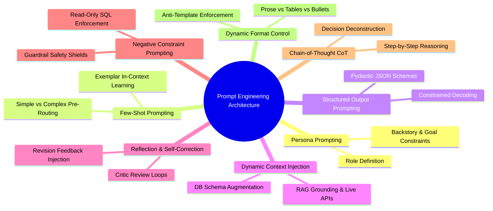

# Prompt Engineering Techniques — Architecture & Technical Guide

## Executive Summary

The **Finance Risk & Investment Intelligent System** uses a multi-layered **Prompt Engineering Architecture** to achieve enterprise-grade accuracy, deterministic tool usage, safety compliance, and natural conversational responses. Rather than relying on simple unstructured prompts, the system combines **8 core Prompt Engineering techniques** across its multi-agent workflow.

This document provides a comprehensive guide on **What** these techniques are, **How** they are implemented, and **In Which Files** they operate.

---

## Overview of Prompt Engineering Techniques



---

## 1. Role-Based & Persona Prompting

### What It Is
Persona prompting defines an explicit identity, professional role, functional backstory, and domain authority for each LLM agent.

### Why & How It Is Used
In a multi-agent system, generic LLMs suffer from domain confusion. By giving each agent a distinct persona and strict operational boundaries, agents stay within their domain expertise (e.g., SQL Agent only queries databases; Risk Agent only performs web search for market risks).

### Files & Code Implementation
- **[ManagerAgent.py](file:///d:/NIIT/Project_Step/financeintel/backend/Agents/ManagerAgent.py#L9-L28)**: Defines the supervisor persona (`role="Finance Intelligence Manager"`).
- **[SQLAgent.py](file:///d:/NIIT/Project_Step/financeintel/backend/Agents/SQLAgent.py#L11-L25)**: Defines the database analyst persona (`role="SQL Agent"`).
- **[RiskAgent.py](file:///d:/NIIT/Project_Step/financeintel/backend/Agents/RiskAgent.py#L10-L21)**: Defines global market risk analyst persona (`role="Risk Intelligence Specialist"`).
- **[RAGAgent.py](file:///d:/NIIT/Project_Step/financeintel/backend/Agents/RAGAgent.py#L10-L25)**: Defines document retrieval persona (`role="Document RAG Specialist"`).
- **[MarketAgent.py](file:///d:/NIIT/Project_Step/financeintel/backend/Agents/MarketAgent.py#L10-L25)**: Defines live market data analyst persona (`role="Market Data Analyst"`).
- **[CriticAgent.py](file:///d:/NIIT/Project_Step/financeintel/backend/Agents/CriticAgent.py#L101-L125)**: Defines the objective auditor persona (`role="Senior Financial Analyst & Fact-Checker"`).

```python
# Example from backend/Agents/RiskAgent.py
risk_agent = Agent(
    role="Risk Intelligence Specialist",
    goal="Search the internet and web sources to identify and analyze market-wide financial risks...",
    backstory="You are a global market risk analyst who monitors macroeconomic environments...",
    tools=[WebSearchTool()],
)
```

---

## 2. Few-Shot Exemplar Prompting

### What It Is
Few-shot prompting feeds explicit, high-quality input-output examples directly into the prompt context.

### Why & How It Is Used
Small models (e.g., Ollama `llama3.2:3b`) can misclassify ambiguous user queries. Providing representative positive and negative examples inside the prompt establishes in-context pattern matching for high pre-routing accuracy without model fine-tuning.

### Files & Code Implementation
- **[Ollama_Router_Service.py](file:///d:/NIIT/Project_Step/financeintel/backend/Services/Ollama_Router_Service.py#L175-L180)**: Provides concrete examples for classifying queries as `SIMPLE` (direct Ollama answer) or `COMPLEX` (multi-agent graph pass).

```python
# Example from backend/Services/Ollama_Router_Service.py
_ROUTER_PROMPT = """Classify this message as SIMPLE or COMPLEX, and if SIMPLE, provide a clear answer:

SIMPLE examples: "hello", "hi", "thanks", "what is a mutual fund?", "explain diversification", "what is SIP?"
COMPLEX examples: "give me top performers in SIPs", "how to invest 10000 per month", "summarize tech sector market risks", "how is AAPL doing today?"

Message: {query}"""
```

---

## 3. Structured Output Prompting (JSON Schema Constrained Decoding)

### What It Is
Structured output prompting enforces LLM completion engines to emit strict JSON matching a pre-compiled Pydantic schema using constrained grammar decoding.

### Why & How It Is Used
Natural language outputs from LLMs are unpredictable and prone to syntax errors when parsed programmatically. Forcing JSON schema validation guarantees deterministic state fields (such as confidence scores, classification verdicts, and revision instructions).

### Files & Code Implementation
- **[Ollama_Router_Service.py](file:///d:/NIIT/Project_Step/financeintel/backend/Services/Ollama_Router_Service.py#L155-L170)**: Enforces `RouterVerdict` Pydantic schema.
- **[CriticAgent.py](file:///d:/NIIT/Project_Step/financeintel/backend/Agents/CriticAgent.py#L114-L135)**: Enforces `CriticVerdict` Pydantic schema.

```python
# Example Pydantic Schema from backend/Agents/CriticAgent.py
class CriticVerdict(BaseModel):
    confidence: float = Field(..., description="Confidence score from 0.00 to 1.00.")
    is_well_attributed: bool = Field(..., description="True if facts are cited accurately.")
    issues: list[str] = Field(default_factory=list, description="List of flagged issues.")
    revision_instructions: str = Field("", description="Actionable instructions if revision is needed.")
```

---

## 4. Dynamic Context-Aware Prompt Injection (Prompt Augmentation)

### What It Is
Context injection dynamically retrieves runtime state data (database schema descriptions, live ticker prices, available PDF lists) and interpolates them directly into the task prompt context before passing it to the agent.

### Why & How It Is Used
Prevents hallucinations and outdated knowledge by grounding the LLM in real-time context. The agent does not need to guess database tables or ticker prices because the prompt explicitly provides current facts.

### Files & Code Implementation
- **[Crew.py](file:///d:/NIIT/Project_Step/financeintel/backend/Nodes/Crew.py#L108-L155)**: Dynamically injects `{detected_symbols}`, `{market_data}`, `{documents_note}`, and `{database_schema}` into `task_description`.

```python
# Example context injection from backend/Nodes/Crew.py
task_description = (
    f"Analyst query:\n{query}\n\n"
    f"Detected Symbols:\n{detected_symbols}\n\n"
    f"Market Data:\n{market_data}\n\n"
    f"Uploaded Documents:\n{documents_note}\n\n"
    f"Available Database Schema:\n{database_schema}\n\n"
)
```

---

## 5. Reflection & Self-Correction Prompting (Iterative Refinement)

### What It Is
Reflection prompting passes feedback, identified errors, and revision instructions from a Critic agent back into the generator agent's prompt during retry iterations.

### Why & How It Is Used
If the initial draft output lacks attribution or accuracy, passing the Critic's specific feedback into the prompt enables the LLM to reflect on its mistake and self-correct on the next iteration pass.

### Files & Code Implementation
- **[Crew.py](file:///d:/NIIT/Project_Step/financeintel/backend/Nodes/Crew.py#L160-L165)**: Appends revision feedback to the prompt when `revision_instructions` is non-empty.
- **[CriticAgent.py](file:///d:/NIIT/Project_Step/financeintel/backend/Agents/CriticAgent.py#L160-L210)**: Generates actionable `revision_instructions`.

```python
# Example from backend/Nodes/Crew.py
if revision_instructions:
    task_description += (
        f"\nIMPORTANT - this is a REVISION pass. A prior draft was "
        f"reviewed and found insufficient. Address these specific "
        f"issues before finalizing:\n{revision_instructions}\n"
    )
```

---

## 6. Negative Constraint & Safety Guardrail Prompting

### What It Is
Negative constraint prompting explicitly instructs the model what actions, terms, or formats are **strictly forbidden**.

### Why & How It Is Used
Ensures security, read-only data integrity, and compliance. For instance, SQL agents must be prevented from executing destructive SQL operations (`DROP`, `DELETE`, `UPDATE`), and the general model must be shielded from jailbreaks or off-topic prompts.

### Files & Code Implementation
- **[SQLAgent.py](file:///d:/NIIT/Project_Step/financeintel/backend/Agents/SQLAgent.py#L13-L20)**: Negative rule: "Writing precise, read-only SQL SELECT queries. Never guess column names."
- **[Guardrail_Service.py](file:///d:/NIIT/Project_Step/financeintel/backend/Services/Guardrail_Service.py#L30-L120)**: Enforces regex-level safety constraints for SQL injection, PII protection, out-of-domain defense, and jailbreaks.

---

## 7. Chain-of-Thought (CoT) Prompting

### What It Is
Chain-of-Thought prompting directs the LLM to deconstruct complex questions into logical intermediate steps before producing a conclusion.

### Why & How It Is Used
Improves reasoning accuracy on complex multi-step financial problems (such as determining whether data resides in SQL, vector DB, or live APIs).

### Files & Code Implementation
- **[Crew.py](file:///d:/NIIT/Project_Step/financeintel/backend/Nodes/Crew.py#L111-L134)**: Explicit step-by-step evaluation guide for selecting specialist agents.
- **[CriticAgent.py](file:///d:/NIIT/Project_Step/financeintel/backend/Agents/CriticAgent.py#L10-L100)**: Deconstructs legal fact checking into step-by-step missing fact evaluation before scoring confidence.

```python
# CoT Step-by-Step Instruction in backend/Nodes/Crew.py
"Analyze the analyst's request carefully.\n"
"Determine whether the request requires:\n"
"- SQL database records\n"
"- PDF/document retrieval\n"
"- Market data\n"
"- Internet financial risk analysis\n\n"
"Always prioritize SQL Agent when..."
```

---

## 8. Dynamic Style & Format Control Prompting

### What It Is
Dynamic format control instructs the model to tailor its output structure (natural prose vs formatted Markdown tables vs bullet points) dynamically according to query intent, forbidding rigid templates unless requested.

### Why & How It Is Used
Prevents ugly, boilerplate AI responses (e.g. forcing 'Summary', 'Key Risks', 'Recommendations' headers on simple direct questions like "what is a mutual fund?").

### Files & Code Implementation
- **[Crew.py](file:///d:/NIIT/Project_Step/financeintel/backend/Nodes/Crew.py#L147-L154)**: Enforces natural, intent-based Markdown formatting.

```python
# Anti-Template Formatting Rules in backend/Nodes/Crew.py
"DYNAMIC RESPONSE STYLING & STRUCTURE:\n"
"- Act as a natural, intelligent financial AI chat assistant.\n"
"- Dynamically tailor the output structure to what the user's query specifically requests.\n"
"- Do NOT force rigid static sections like 'Summary', 'Key Risks', 'Recommendation' unless requested.\n"
"- For simple questions, answer directly and concisely in natural conversational prose.\n"
```

---

## Summary Matrix of Prompt Engineering Techniques

| Technique | Primary File(s) | Architectural Purpose |
| :--- | :--- | :--- |
| **1. Role-Based Personas** | `ManagerAgent.py`, `RiskAgent.py`, `SQLAgent.py`, `RAGAgent.py`, `MarketAgent.py`, `CriticAgent.py` | Assigns domain specialization & strict agent boundaries. |
| **2. Few-Shot Exemplars** | `Ollama_Router_Service.py` | In-context classification learning for fast pre-routing. |
| **3. Structured Outputs** | `Ollama_Router_Service.py`, `CriticAgent.py` | Guarantees deterministic Pydantic JSON schema output. |
| **4. Dynamic Context Injection** | `Crew.py` | Prevents hallucinations by grounding LLM in real-time schema & live web data. |
| **5. Reflection & Self-Correction** | `Crew.py`, `CriticAgent.py` | Injects Critic review feedback into prompt for iterative revision passes. |
| **6. Negative Constraints & Safety** | `SQLAgent.py`, `Guardrail_Service.py` | Enforces read-only operations, jailbreak defenses, and safety rules. |
| **7. Chain-of-Thought (CoT)** | `Crew.py`, `CriticAgent.py` | Guides step-by-step reasoning for agent selection & fact evaluation. |
| **8. Dynamic Format Control** | `Crew.py` | Ensures natural conversational prose without rigid boilerplate report templates. |
