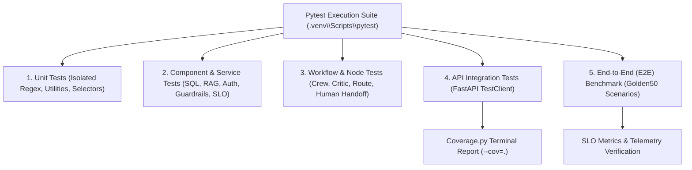
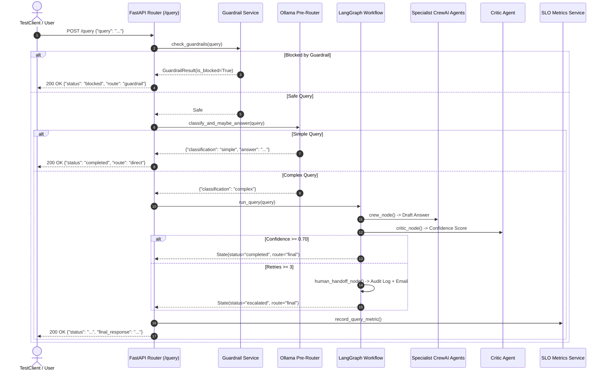

# Comprehensive Testing Framework — Architecture, E2E Strategy & File Map

## Executive Summary

The **Finance Risk & Investment Intelligent System** uses an automated, multi-tiered testing architecture powered by **Pytest**, **FastAPI TestClient**, **Coverage.py**, and the **Golden50 Scenario Benchmark**. Because the application combines financial market analytics, multi-agent AI execution, read-only SQL querying, document vector search (RAG), and safety guardrails, testing is designed to guarantee deterministic behavior, zero data corruption, and high statement coverage.

This document details **Why** testing is conducted, **What** testing layers exist, **Which Files** implement test cases, **How** they work, and how **End-to-End (E2E) Testing** is structured.

---

## Testing Architecture Overview



---

## 1. WHY Testing is Done (Purpose & Objectives)

> [!IMPORTANT]
> **Financial & Systemic Reliability**: In financial applications, incorrect calculations, hallucinated facts, or unauthorized SQL database modifications carry severe consequences. Automated testing guarantees safety constraints and multi-agent stability.

### Primary Objectives
1. **Guardrail & Safety Verification**: Ensures forbidden operations (SQL injection, jailbreaks, PII leakage, offensive text, out-of-domain baking recipes) are blocked deterministically.
2. **Multi-Agent Workflow Integrity**: Verifies state transitions in the LangGraph graph (`crew_node` $\rightarrow$ `critic_node` $\rightarrow$ `route_decision` $\rightarrow$ `human_handoff_node`).
3. **Data Integrity & Security**: Confirms that database operations are strictly read-only (`SELECT`), password hashing uses `bcrypt`, and JWT tokens are authenticated.
4. **End-to-End Regression Prevention**: Validates end-to-end system responses against the 50 golden benchmark scenarios in `Golden50.json`.

---

## 2. WHAT Types of Testing Are Conducted

### 1. Unit Testing
Tests atomic functions in isolation without external database or LLM network calls.
- *Examples*: Ticker symbol extraction (`extract_tickers()`), regex patterns for SQL injection/PII, route branch selectors (`route_branch()`), legal fact detection (`detect_incomplete_legal_question()`).

### 2. Component & Service Testing
Tests core business logic services with mock state or local SQLite instances.
- *Examples*: Read-only SQL query execution (`SQL_Service.py`), document text extraction & vector indexing (`RAG_Service.py`), user auth/registration (`Auth_Service.py`), SLO metric accumulation (`SLO_Metrics_Service.py`).

### 3. Workflow Node & Agent State Testing
Tests individual LangGraph nodes and decision branches.
- *Examples*: Verifying that `confidence < 0.70` after 3 revision attempts routes to `"human_handoff"` and generates a local JSON log file.

### 4. Integration API Testing (FastAPI `TestClient`)
Tests HTTP API endpoints end-to-end using `starlette.testclient.TestClient(app)`.
- *Endpoints tested*: `/query`, `/query/stream`, `/auth/register`, `/auth/login`, `/auth/profile`, `/conversations`, `/documents/upload`, `/metrics/slo`.

### 5. End-to-End (E2E) Golden Scenario Benchmark
Tests complete end-to-end query input paths against **`Golden50.json`**, covering 50 realistic user scenarios across all 9 operational categories.

---

## 3. WHICH Files Are Involved & HOW They Work

| Test File Path | Primary Functions / Targets Tested | How It Works & What It Verifies |
| :--- | :--- | :--- |
| **[test_guardrails.py](file:///d:/NIIT/Project_Step/financeintel/backend/tests/test_guardrails.py)** | `check_guardrails()` | **Safety Engine Suite**: Verifies all 8 guardrail rules. Asserts prompt length blocking, out-of-domain cake recipe blocking, jailbreak defense, profanity blocking, SQL injection (`DROP TABLE`) rejection, PII credit card masking, and missing database/document resource blocks. |
| **[test_human_handoff.py](file:///d:/NIIT/Project_Step/financeintel/backend/tests/test_human_handoff.py)** | `human_handoff_node()`, `decide_route()` | **Escalation Suite**: Verifies that when `confidence < 0.70` and `revise_count >= 3`, the decision engine returns `"human_handoff"`, saves an audit log to `./data/escalations/`, and outputs a formatted escalation notice. |
| **[test_slo_metrics.py](file:///d:/NIIT/Project_Step/financeintel/backend/tests/test_slo_metrics.py)** | `record_query_metric()`, `get_aggregated_slo_metrics()` | **Telemetry Suite**: Tests metric recording, average latency calculations, agent execution breakdown, guardrail block counts, and `human_handoff_rate` percentages. |
| **[test_router.py](file:///d:/NIIT/Project_Step/financeintel/backend/tests/test_router.py)** | `classify_and_maybe_answer()`, `_mentions_database_query()` | **Pre-Router Suite**: Tests fast-path routing. Confirms greetings return `SIMPLE` directly, while document references, database keywords, and actionable recommendation requests force `COMPLEX` multi-agent graph execution. |
| **[test_sql_service.py](file:///d:/NIIT/Project_Step/financeintel/backend/tests/test_sql_service.py)** | `run_readonly_query()`, `FORBIDDEN_KEYWORDS` | **SQL Security Suite**: Verifies read-only `SELECT` query execution, Markdown table output generation, and strict regex blocking of `UPDATE`, `DELETE`, `DROP`, or `INSERT` statements. |
| **[test_auth_register.py](file:///d:/NIIT/Project_Step/financeintel/backend/tests/test_auth_register.py)** | `/auth/register` endpoint | **Auth Registration Suite**: Tests user registration, password hashing (`bcrypt`), email uniqueness constraints, and invalid input validation. |
| **[test_profile_update.py](file:///d:/NIIT/Project_Step/financeintel/backend/tests/test_profile_update.py)** | `/auth/profile` endpoint | **Profile Suite**: Tests updating user profile metadata (full name, email), database persistence, and authorization token validation. |
| **[test_langfuse_client.py](file:///d:/NIIT/Project_Step/financeintel/backend/tests/test_langfuse_client.py)** | `observe_span()` | **Observability Suite**: Verifies Langfuse tracing span creation, metadata updates, and graceful fallback when tracing is disabled. |
| **[test_coverage_boost.py](file:///d:/NIIT/Project_Step/financeintel/backend/tests/test_coverage_boost.py)** | FastAPI `TestClient`, DB & RAG Services | **Comprehensive Integration Suite**: Drives full API request cycles across all FastAPI endpoints, multi-turn conversation CRUD operations, vector RAG search, and graph route branches. |
| **[Golden50.json](file:///d:/NIIT/Project_Step/financeintel/Golden50.json)** | 50 Functional Workflow Scenarios | **E2E Scenario Benchmark**: Standardized dataset containing query inputs, routing expectations, confidence scores, and compact output requirements across 9 functional categories. |

---

## 4. END-TO-END (E2E) TESTING STRATEGY

### E2E Testing Architecture
The End-to-End testing pipeline simulates complete user interactions from HTTP request arrival to final response generation.



### The Golden50 Benchmark Dataset (`Golden50.json`)
The system is evaluated against **50 golden scenarios** categorized into 9 distinct sections:

1. **Guardrails & Safety Engine (Scenarios 1–6)**: Length limit, out-of-domain cake recipe, jailbreaks, profanity, SQL injection, PII credit cards.
2. **Ollama Pre-Router (Scenarios 7–12)**: Simple greetings ("hello", "what is SIP?"), direct answers.
3. **SQL Specialist Agent (Scenarios 13–18)**: Portfolio holdings, asset risk logs, database analytics.
4. **RAG Specialist Agent (Scenarios 19–25)**: PDF policies, compliance manuals, uploaded document retrieval.
5. **Market Specialist Agent (Scenarios 26–32)**: Ticker quotes, stock price comparisons, AAPL market data.
6. **Internet Risk Intelligence Agent (Scenarios 33–37)**: Tech sector risks, VaR concepts, macro concentration, S&P 500 volatility, credit default trends.
7. **Reflection & Critic Review Loop (Scenarios 38–43)**: Critic revision passes, factual attribution checks.
8. **Human Handoff Escalation (Scenarios 44–48)**: Ambiguous facts, max retries reached, legal close-out netting.
9. **System APIs, Auth & Data Bundles (Scenarios 49–50)**: Login JWT tokens, conversation CRUD operations.

---

## 5. How to Run Tests & Inspect Coverage

### Executing All Tests
Run pytest within the backend virtual environment:

```bash
.venv\Scripts\pytest
```

### Running with Statement Coverage Report
To view detailed line-by-line coverage output:

```bash
.venv\Scripts\pytest --cov=. --cov-report=term-missing
```

### Pytest Configuration (`[pyproject.toml](file:///d:/NIIT/Project_Step/financeintel/backend/pyproject.toml#L37-L40)`)

```toml
[tool.pytest.ini_options]
testpaths = ["tests"]
python_files = ["test_*.py"]
addopts = "-v --cov=. --cov-report=term-missing --cov-config=.coveragerc"
```

---

## Summary Checklist

- [x] **Why**: Guarantees financial calculation accuracy, safety guardrail enforcement, read-only SQL security, and CI regression testing.
- [x] **What**: 5 testing tiers (Unit, Component/Service, Workflow Node, FastAPI Integration, Golden50 E2E Benchmark).
- [x] **Which Files**: `test_guardrails.py`, `test_human_handoff.py`, `test_slo_metrics.py`, `test_router.py`, `test_sql_service.py`, `test_auth_register.py`, `test_profile_update.py`, `test_langfuse_client.py`, `test_coverage_boost.py`, `Golden50.json`.
- [x] **How**: Executes via `.venv\Scripts\pytest` using FastAPI `TestClient`, SQLite test instances, and `pytest-cov`.
- [x] **E2E**: Full request-to-response sequence diagram and Golden50 benchmark scenarios.
