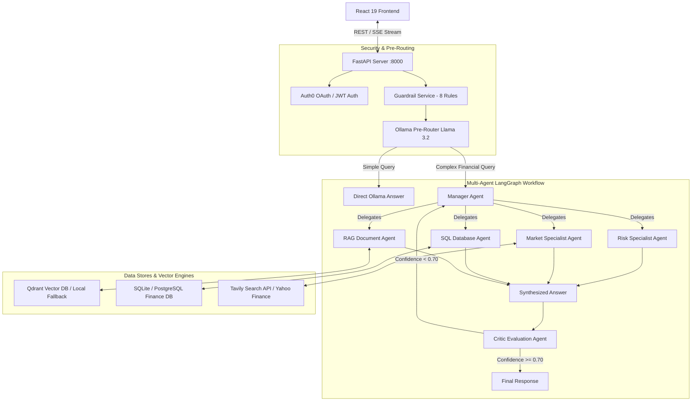

# Finance Risk & Investment Intelligence System — Architecture & System Design

A production-grade, multi-agent AI system for financial risk analysis, investment performance evaluation, and regulatory exposure assessment.

---

## 1. Executive Summary & Design Philosophy

The system combines:
1. **Multi-Agent Orchestration** (CrewAI + LangGraph) for structured reasoning and self-reflection.
2. **Multimodal RAG Pipeline** (Qdrant + Azure OpenAI Vision + PyMuPDF) for tabular and visual PDF document parsing.
3. **Structured Financial Data Pipeline** (SQLite / PostgreSQL) for SQL analytics on portfolio holdings.
4. **Multi-Layer Safety & Guardrails** (8-rule validation engine) preventing prompt injections, PII leaks, unsafe financial advice, and financial crimes.
5. **Modern React Frontend** (Vite + React 19 + Tailwind CSS) with real-time SSE query phase tracking and Auth0 email verification.

---

## 2. System Architecture Diagram

---

## 3. Component Deep Dive

### 3.1 Multi-Agent State Machine (`graph.py` & `Nodes/`)
- **Manager Agent**: Receives user query, breaks down financial objectives, delegates sub-tasks to specialists.
- **Specialist Agents**:
  - `RiskAgent`: Analyzes sector concentration, VaR, volatility, and benchmark underperformance.
  - `MarketAgent`: Pulls real-time market data via Tavily Search API & Yahoo Finance (`yfinance`).
  - `SQLAgent`: Generates and executes read-only SQL queries against financial databases.
  - `RAGAgent`: Performs vector similarity search over uploaded financial reports and prospectus documents.
- **Critic Agent**: Reviews generated answers against strict financial accuracy and attribution criteria. If confidence $< 0.70$, triggers revision retries (up to `MAX_REVISE_RETRIES = 3`).

### 3.2 Multimodal Knowledge Retrieval (RAG Pipeline)
- **Document Ingestion**: `PyMuPDF` extracts text blocks and formats embedded tables into clean Markdown (`| Col 1 | Col 2 |`).
- **Vision AI Analysis**: Embedded charts, figures, and scanned pages are passed to **Azure OpenAI Vision** (`gpt-4o-mini`), producing semantic descriptions of data trends and axis values.
- **Vector Storage**: Chunked text and vision summaries are embedded using Azure OpenAI `text-embedding-3-small` (1536 dim) and indexed into Qdrant. If cloud Qdrant is unreachable, the system gracefully falls back to local disk storage (`./data/qdrant_db`).

### 3.3 Multi-Layer Guardrail Protection (`Services/Guardrail_Service.py`)
Intercepts queries before agent execution:
1. **Length Limit**: Blocks prompts $> 5,000$ words.
2. **Jailbreak & Out-of-Domain**: Rejects off-topic queries (recipes, poems, sports) and system prompt overrides.
3. **Offensive Language**: Blocks profanity and insults.
4. **SQL Injection**: Rejects `DROP TABLE`, `DELETE FROM`, `UNION SELECT`, `1=1`.
5. **PII Masking**: Blocks Credit Cards, CVVs, Passwords, OTPs, Aadhaar, and PAN numbers.
6. **Unsafe Financial Advice**: Restricts guaranteed return predictions or "invest life savings" prompts.
7. **Financial Crimes**: Blocks queries on money laundering, tax fraud, insider trading, or market manipulation.
8. **Resource Availability**: Confirms documents/tables exist before running queries targeting uploaded files/databases.

### 3.4 Security & User Management
- **Auth0 OAuth2 Integration**: Password-realm authentication issuing JWT tokens.
- **Email Verification**: User registration calls Auth0 `dbconnections/signup` API, sending real verification emails to user inboxes.
- **Local Credentials Sync**: User profiles and hashed credentials are persisted in `./data/db/finance.db`.

---

## 4. Design Decisions & Trade-Offs

1. **Ollama Pre-Router vs. Full Crew Execution**:
   - *Decision*: Simple conversational queries bypass the multi-agent graph to reduce latency from $\sim 10s$ down to $< 1s$.
2. **Qdrant Cloud with Local Fallback**:
   - *Decision*: Avoids single point of failure if cloud network or DNS fails during development/deployment.
3. **Markdown Table Ingestion for RAG**:
   - *Decision*: Preserves column alignment and financial metric placement better than unstructured text streams.

